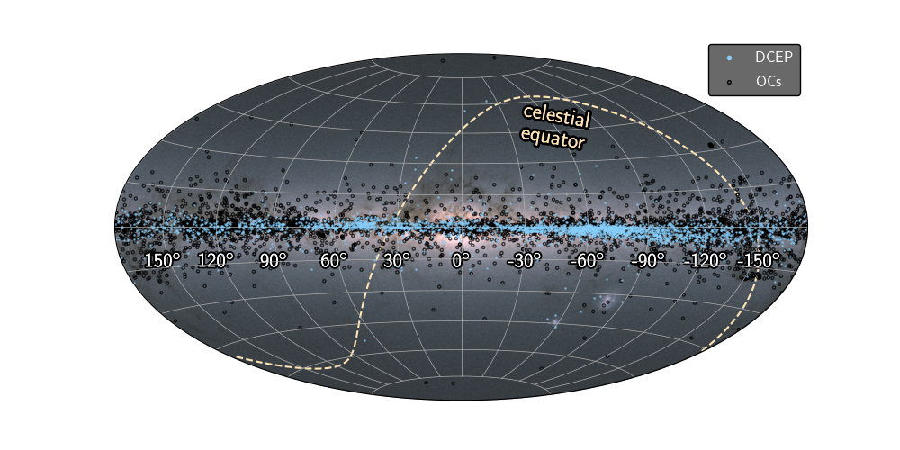
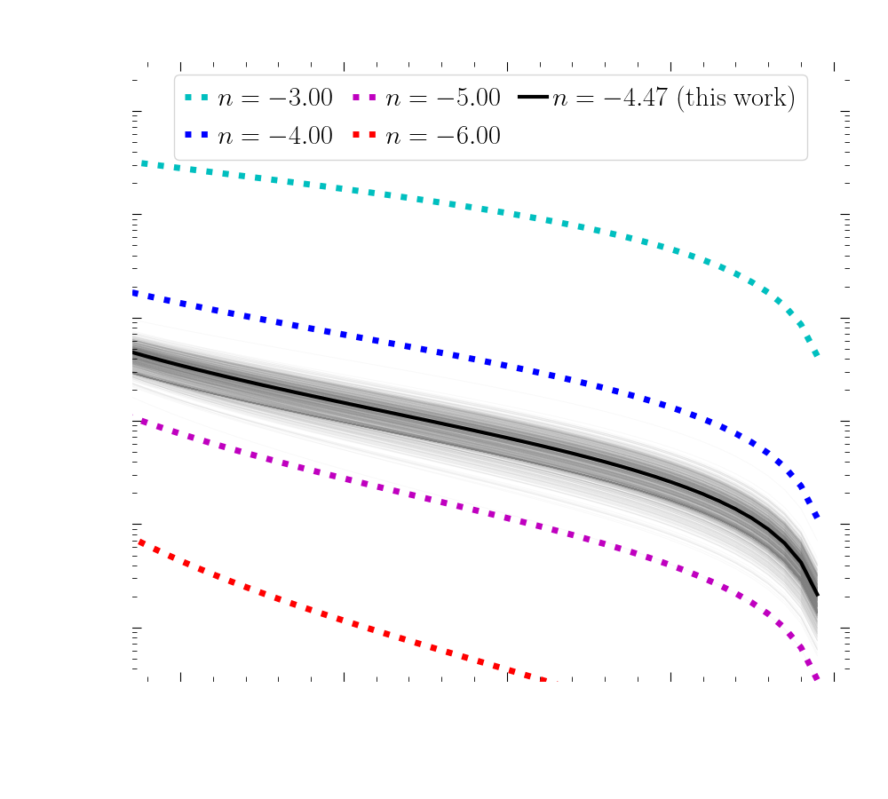
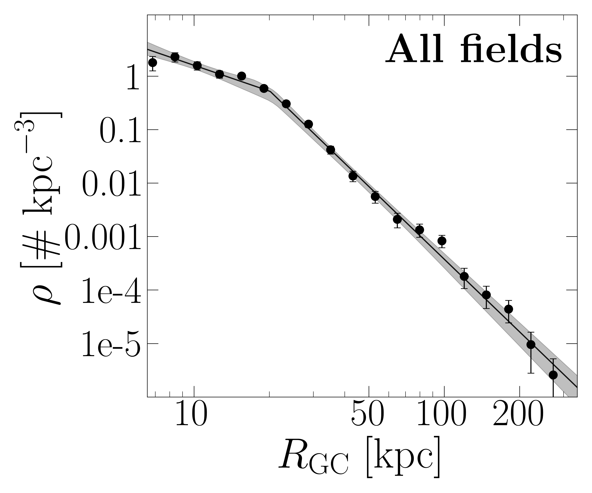

## Research Highlights

[NASA/ADS Page, Refereed only](https://ui.adsabs.harvard.edu/public-libraries/Wfv16gZaRPuwbDI3G4b6wA)

<!-- ## Research Highlight Title 1
**Description:**
[Write a brief description of the research highlight, including the context and importance of the work.]

**Key Findings:**
- [Finding 1]
- [Finding 2]
- [Finding 3]

**Relevant Links/Publications:**
- [Link to publication or related resource]
- [Link to additional resource]

---

## Research Highlight Title 2
**Description:**
[Write a brief description of the research highlight, including the context and importance of the work.]

**Key Findings:**
- [Finding 1]
- [Finding 2]
- [Finding 3]

**Relevant Links/Publications:**
- [Link to publication or related resource]
- [Link to additional resource]

--- -->

# Research

## Galactic archaeology with variable stars
...

### Project 1
Description Project 1
- plot project 1

### Project 2 
Description Project 2
- plot project 2

### Project 3
Description Project 3
- plot project 3

### Project 4
Description Project 4
- plot project 4

    <!-- Image on the left of text -->
    
    

        Here is some information about the galactic map. The text here should be on the right half of the webpage, while the image is on the left. I'm hoping to make this paragraph pretty long to show how it might look if you have a lot to say about it. Of course, you don't have to be talking about the image at all here, you could talk about how cool you are and just have this image because it's pretty and is a kinda nice intro to what your work focuses on.
    

In here, I'm going to put some words so that we can see what it will look like to have long paragraphs in between images! I think you should have a picture of yourself in the about me section. I know it's kinda controversial, so maybe you don't put it on the front page, but hidden in one of the other tabs if I can get those working. It would be perfect if you had a candid shot of you working or presenting or something so that maybe the focus isn't just on showing your face. But a lot of university faculty sites have pictures of the professors! It just adds a little familiarity to remind the people reading it that they are affecting the life of a real person. Also, you are kinda recognizable haha, so maybe there's someone that's seen you, but doesn't know your name!

    

        This image shows the halo profile. At least, that's what the title says. I don't really know what the rest of the words in the file name mean, but I bet you do! anyways, here's another block of text so we can see that this time, the image is on the right side and the test is on the left. I hope this all is working. using html here is bringing me back to my Neopets days, when I first figured out coding so I could customize my neopet's profiles haha. I was such a nerd.
    

    <!-- Image on the right of text -->
    

    <!-- Image on the left of text -->
    
    

        The two plots here have shading? I'm trying to decipher these titles but I don't know anything haha. Anyways, you are awesome and are doing so much! I hope this website helps show people all the things you do! It would be really cool for you to have a place to talk about some of the things you've done that don't really have a place anywhere in your applications. If you talk candidly about some of your outreach things in Chile, or side stuff you've done at UT, I bet people would read it and see a bit more of your personality so they could decide if you'd be a good match for their programs or not. 
    

